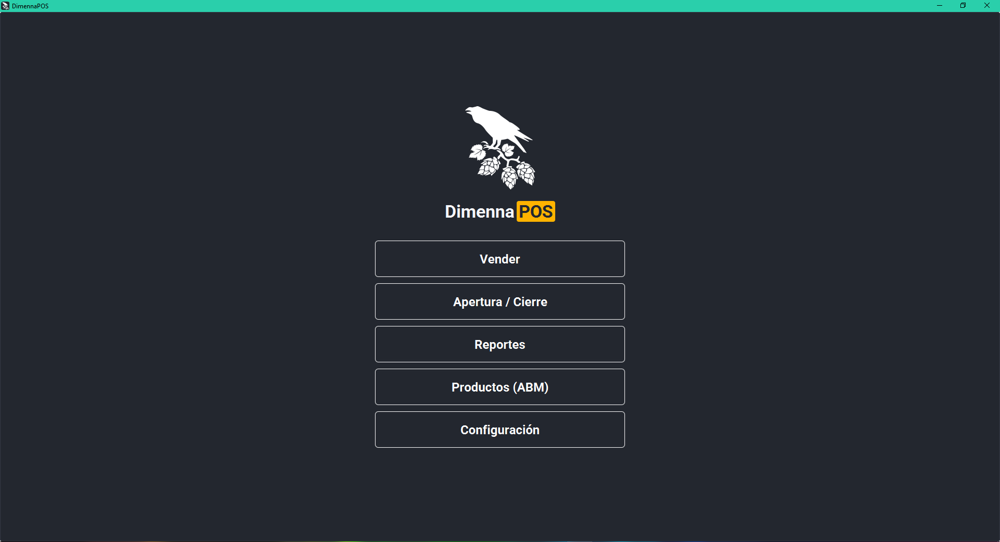
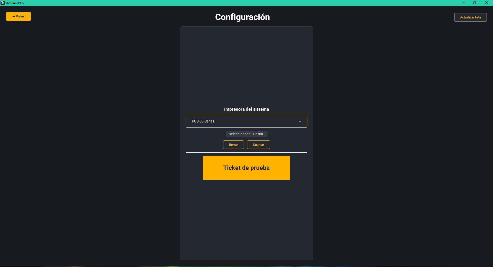
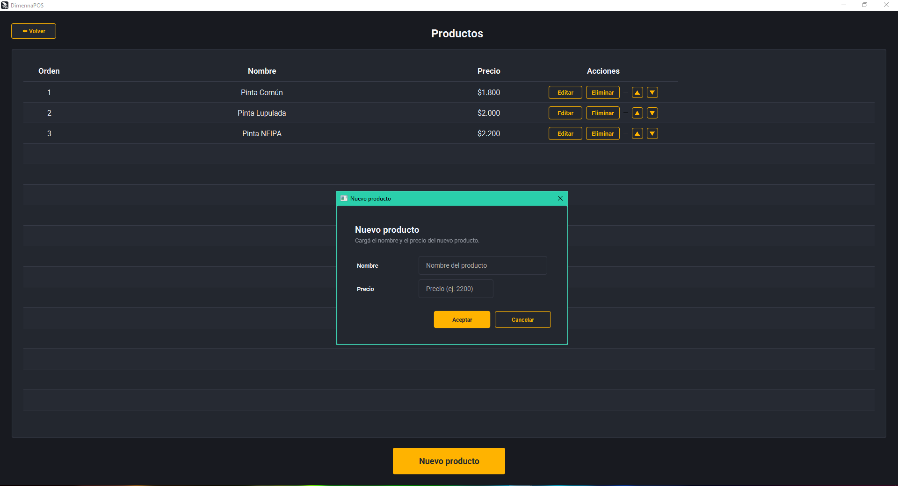
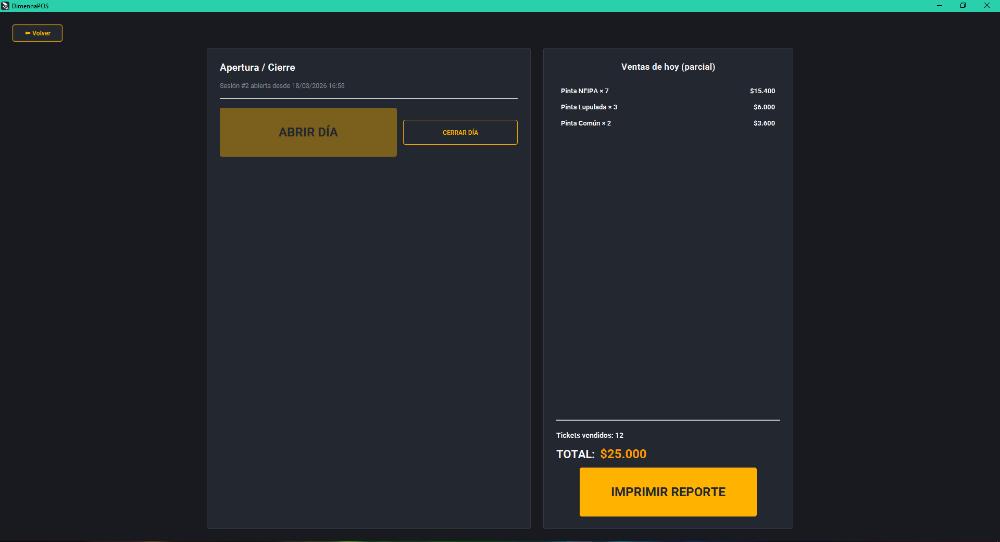
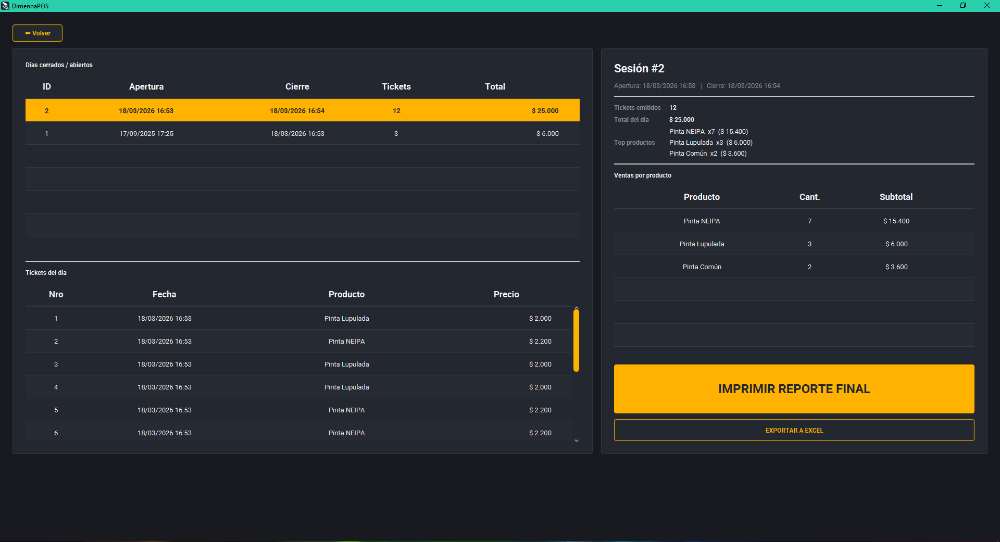
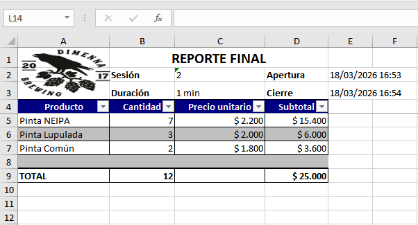
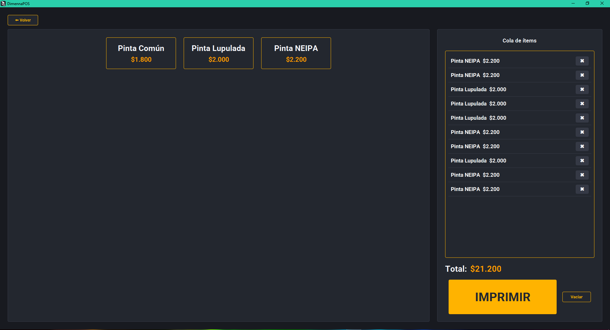

# DimennaPOS - Sistema de Punto de Venta

  
  
  
  
  
  

Sistema de punto de venta desarrollado para **Dimenna Taproom**, diseñado para operar en foodtrucks durante eventos y festivales, permitiendo gestionar ventas, impresión de tickets y generación de reportes de manera eficiente y sin conexión a internet.

---

## Descripción

DimennaPOS fue desarrollado como una solución para la gestión de ventas en un entorno dinámico como un foodtruck, donde la rapidez de operación y la simplicidad de uso son fundamentales.

El sistema está optimizado para ser utilizado en dispositivos táctiles (tablets o POS), eliminando la necesidad de teclado o mouse. Su diseño prioriza una interfaz clara con botones grandes e interacción directa, permitiendo que cualquier empleado pueda operar el sistema sin capacitación técnica.

Además, integra impresión de tickets mediante impresora térmica y permite gestionar múltiples ventas en cola para optimizar la atención en momentos de alta demanda.

---

## Funcionalidades

- ✅ Gestión de ventas con interfaz táctil  
- ✅ Generación e impresión de tickets  
- ✅ Manejo de cola de pedidos para impresión masiva  
- ✅ Apertura y cierre de sesión diaria  
- ✅ Reportes de ventas en tiempo real (parcial)  
- ✅ Reportes finales por sesión  
- ✅ Exportación de reportes a Excel  
- ✅ ABM de productos (con orden personalizado)  
- ✅ Configuración de impresora térmica  
- ✅ Historial completo de sesiones y ventas  

---

## Tecnologías

El sistema fue desarrollado como aplicación de escritorio utilizando:

- **Java + JavaFX** (interfaz gráfica)  
- **SQLite** (base de datos local)

El uso de SQLite permite operar completamente offline, lo cual es fundamental para su uso en eventos donde no se dispone de conexión a internet.

---

## Capturas del sistema

### Pantalla principal

---

### Configuración de impresora

---

### Gestión de productos (ABM)

---

### Apertura / cierre y ventas del día

---

### Reportes de sesiones

---

### Exportación a Excel

---

### Interfaz de ventas

---

## Características clave

- Funcionamiento completamente offline  
- Interfaz optimizada para pantallas táctiles  
- Operación rápida en entornos de alta demanda  
- Integración con impresoras térmicas  
- Sistema orientado a uso real en eventos  

---

## 📌 Nota

El código disponible en este repositorio corresponde a una versión simplificada del sistema original, publicada con fines demostrativos.

---

## Estado del proyecto

✅ Aplicación en uso real en eventos y operación comercial.
